This page aims to give users an introduction to the Key Mapper interface and a demonstration on how to perform typical tasks with the app.
For specific troubleshooting, [consult the FAQ.](faq.md)

--8<-- "screenshot-version.md"

## First time setup

When you open Key Mapper, you will be presented with this screen.
This screen is referred to as the Key Mapper home screen.

### Set up the accessibility service
 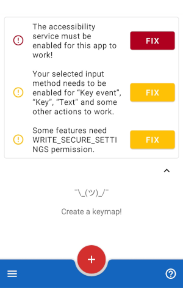

Tapping the FIX button next to the accessibility service prompt will allow you to grant Key Mapper permission to run its accessibility service. You must do this for the app to work at all.

You can then tap Key Mapper in your list of available services. There may be many others on this screen and your interface may be slightly different.

!!! attention
    If nothing happens when you tap FIX, or if you can't enable the service, see [this page](#) or ask for help in the [Discord server.](http://keymapper.club)

 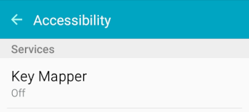

### Set up a Key Mapper keyboard

!!! attention "MUST READ to avoid confusion and headaches"
    **'A Key Mapper keyboard'** through out this documentation refers to any input method that works with Key Mapper. There are **only 2** right now.

    1. The one built-in to Key Mapper is called the "Key Mapper Basic Input Method". This one has **NO** on-screen keyboard. You won't see a keyboard when you want to type something.

    2. If you want an on-screen keyboard to be available while using Key Mapper, you need to install "Key Mapper GUI Keyboard". It is available on the [Google Play Store](http://gui.keymapper.club), [F-Droid](https://www.f-droid.org/en/packages/io.github.sds100.keymapper.inputmethod.latin/) and [GitHub.](https://github.com/sds100/KeyMapperKeyboard/releases)
    
    **'Enable a Key Mapper keyboard'** means turning on the input method in your device's 'Language & Input' settings. The location of these settings is often called something else.
        
    **'Use/choose a Key Mapper keyboard'** means making the Key Mapper keyboard that you have installed the one that shows up when you want to type something. Multiple ways of doing this are described [here](faq.md#how-do-i-change-the-keyboard). Android allows multiple input methods to be *enabled* but only *one* to be used at a time.

Tapping the FIX button next to the input method prompt will allow you to enable a Key Mapper keyboard. If you want to perform actions like pressing keyboard keys or entering text you must enable this.

If you have only installed the Key Mapper app, your list of available keyboards will contain "Key Mapper Basic Input Method" only. If you aim to use a physical keyboard (not on-screen) when using Key Mapper, this will be suitable for you.

 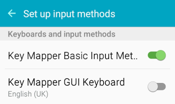

### Disable app-killing

!!! failure "Important"
    If you are using a Huawei or Xiaomi branded device, a device with 2GB of RAM or less, or intend to use the app while playing a mobile game, it is especially important to follow the next step.

    Tapping the FIX button next to the battery optimisation prompt will allow you to turn off features of your device that may prevent Key Mapper's essential services from running in the background. This is usually the source of the common 'Key Mapper randomly stops working' issue.

Older devices (such as my Android 5 device pictured here) do not have this prompt in Key Mapper. However, I was still able to find the setting in my device settings app. Read more below for details.

The screen that opens after tapping FIX may vary depending on your device. In my case, to disable optimisation I found the app(s) in the list, tapped them to open their settings, and chose 'Don't optimise' and on the second device, 'Disabled'.

!!! tip
    There is an excellent guide at [dontkillmyapp.com](http://dontkillmyapp.com) that explains how to disable battery and/or memory optimisation for your specific device. If Key Mapper randomly stops working even after you complete these steps, ask for help in [the Discord server.](http://keymapper.club)

### Setup the ability to properly remap volume buttons

 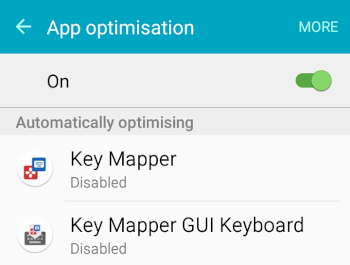

If you want to remap volume buttons and use them when Do Not Disturb is enabled, you should grant Key Mapper permission to do so. If you have an older device, you may not have this as an option.

Tapping FIX will allow you to grant the permission. Find Key Mapper in the list and tap it in order to choose 'Allowed'.

Most people can ignore the final prompt. If you want to create an action to change input method, you need to grant an additional set of permissions called WRITE_SECURE_SETTINGS. For help with this [click here.](../user-guide/adb-permissions/#write_secure_settings)

## Creating a key map

!!! summary
    A key map is an association between a user input (such as pushing a key or button) and a response from the device (sending information about what key was pressed and for how long).

    In Key Mapper, 'user inputs' that are recognised by the app are called 'triggers'. The responses from your device that were due to a trigger being pressed are called 'actions'.

    Key Mapper lets you assign actions to triggers that may be different from their default use. A 'volume up' trigger normally increases the volume when pressed, but this app can change that to something else.

This guide deals with 'Key event' triggers. If you want to remap fingerprint gestures, [check out this guide.](user-guide/fingerprint-gestures.md)

### Setting the trigger(s)

To create your first key map, tap the + icon at the bottom of the Key Mapper home screen. You will see one of the two screens below.

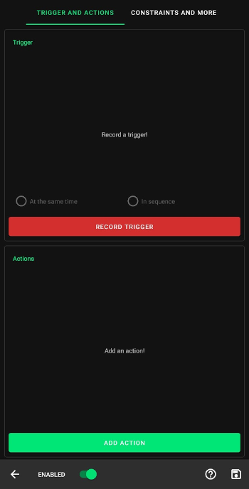 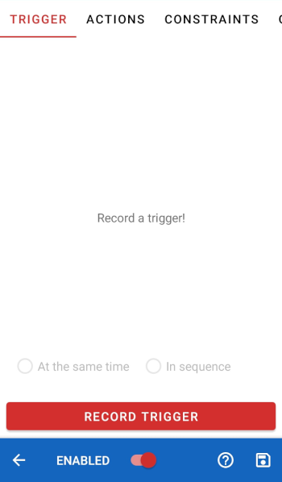

In either case, the first step is to record a trigger. Tap the red 'Record trigger' button and then press the physical button that you want to change the function of. In this guide I will demonstrate with 'volume down'.

Key Mapper can also create a key map with multiple triggers. If you want to use more than one trigger for one key map, you can press the buttons in the order you will press them to execute the key map. For example, if you wanted to map 'Ctrl' + 'H' to show the device home menu, you should press 'Ctrl' and then 'H'.

Key Mapper can also remap fingerprint gestures on many devices. You can learn how to do this [here.](#)

 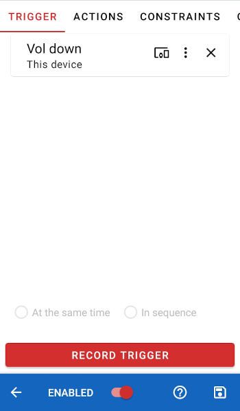

### Setting the action(s)

Next, it's time to choose an action. If you have a high-resolution display, you will see the 'Add action' button at the bottom of the screen (pictured left). Otherwise, tap the 'Actions' tab at the top of the screen (pictured right).

 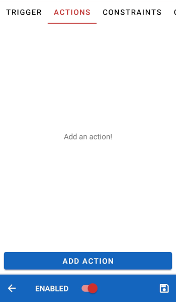

Tap the 'Add action' button at the bottom of this screen. The action selection screen will open. Here you can choose from a wide variety of actions. Swipe left and right to change category, and scroll up and down the list until you find the action you want to add. Below is a table of the different kinds of actions you can choose from in each tab.

--8<-- "action-type-list.md"

For this simple demonstration I will choose KEYCODE_E from the Keycode tab. This action will emulate pressing an E key on a keyboard.

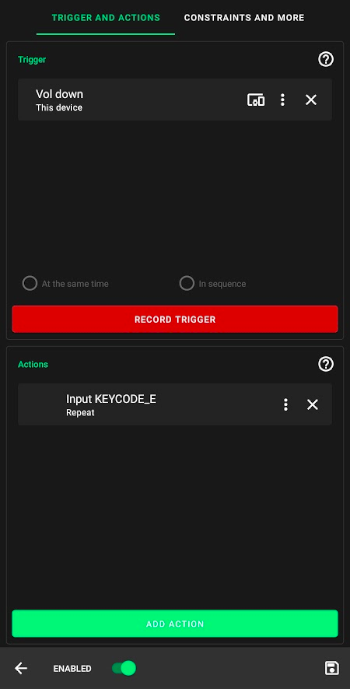 

!!! tip
    Key Mapper can also create a key map with multiple actions. If you want to add more actions to execute in series you can do so by tapping 'Add action' again and choosing the next action in the chain. In the next section you can specify a delay between those actions if you wish.

## Customising a key map

You may wish to customise your triggers and actions to have specific behaviours. Most people will want to do at least some customisation.

### Trigger settings

Starting with the triggers, tap the 3 dot :fontawesome-solid-ellipsis-v: menu to the right of the trigger's name to bring up the following menu.

 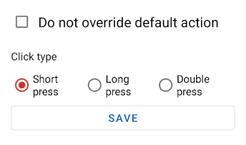 

You can choose from four different settings. Turning on "Do not override default action" will mean that Key Mapper will not replace the normal operation of your trigger, instead it will execute the key map as well as the default operation.

One trigger can have three different click types. Choose from short press, long press and double press. [Read more.](#)

### Customising actions

Next, tap the 3 stacked dots :fontawesome-solid-ellipsis-v: to the right of the action's name to bring up the following menu.

 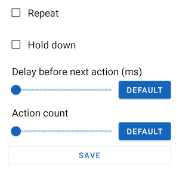

Here you can customise a lot of the operation of your key map, including timing and multipliers.

___

The following details refer to action timing settings.

--8<-- "action-options/delay-before-next-action.md"
___

--8<-- "action-options/action-count.md"
___

#### Repeating actions

--8<-- "action-options/repeat.md"
___

--8<-- "action-options/repeat-every.md"
___

--8<-- "action-options/delay-until-repeat.md"
___

--8<-- "action-options/repeat-behaviour.md"

#### Hold down actions

--8<-- "action-options/hold-down.md"
___

--8<-- "action-options/hold-down-behaviour.md"

#### Using 'Hold down' and 'Repeat' together

--8<-- "action-options/using-hold-down-and-repeat-together.md"

## Special options

You can see explanations of more options [here](../user-guide/keymaps/#special-options).

## Adding constraints

--8<-- "configuring-constraints.md"

## Managing key maps

To save your key map and return to the home screen, tap the save :fontawesome-solid-save: icon in the bottom right of the screen.

Now your key map should already be working. To pause/unpause all of your key maps, pull down the notification tray and tap the Key Mapper notification to toggle between Paused and Running.

 

On the Key Mapper home screen, tap the 3 bar :fontawesome-solid-bars: menu to open the Key Mapper general settings. You will see the following options.

 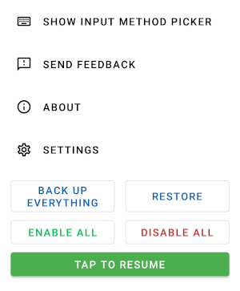

Here you can pause/unpause/enable/disable all of your key maps at once. 
You can also back up and restore key maps here. [Learn more about back up and restore.](#)

Tapping 'Show input method picker' allows for switching between a Key Mapper compatible keyboard and any other. 

!!! tip
    Key Mapper can also remap fingerprint gestures on many devices. You can learn how to do this [here.](#)

[Go to top.](#)