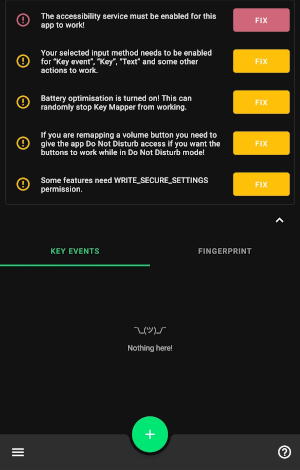
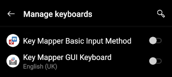
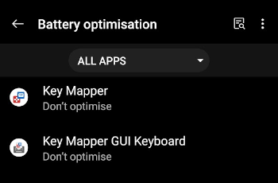

This page aims to give users an introduction to the Key Mapper interface and a demonstration on how to perform typical tasks with the app.
For specific troubleshooting, consult the FAQ.

Where screenshots are necessary, this guide uses two devices to demonstrate.

1. OnePlus 7 Pro, Android 11, Dark Theme, high resolution/dpi screen/1440p 16:9
2. Samsung J3, Android 8, Light Theme, typical resolution/dpi screen/720p 16:9

App interface pictured: `keymapper-2.3.0-alpha-ci.709`

The guide is updated to match current stable release UI. [Report inaccuracies.](https://github.com/sds100/KeyMapper/issues/new)

## First time setup

When you open Key Mapper, you will be presented with this screen.
This screen is referred to as the *Key Mapper home screen*.

Tapping the FIX button next to the accessibility service prompt will allow you to grant Key Mapper permission to run its accessibility service. You must do this for the app to work at all.

You can then tap Key Mapper in your list of available services. There may be many others on this screen and your interface may be slightly different. If nothing happens when you tap FIX, or if you can't enable the service, see [this page](#) or ask for help in the [Discord server](http://keymapper.club).

Tapping the FIX button next to the input method prompt will allow you to enable a Key Mapper compatible keyboard. If you want to perform actions like pressing keyboard keys or entering text you must enable this.

If you have only installed the Key Mapper app, your list of available keyboards will contain "Key Mapper Basic Input Method" only. If you aim to use a physical keyboard (not on-screen) when using Key Mapper, this will be suitable for you.

If you want an on-screen keyboard to be available while using Key Mapper, you need to install "Key Mapper GUI Keyboard". It is available on the [Google Play Store](http://gui.keymapper.club), [F-Droid](https://www.f-droid.org/en/packages/io.github.sds100.keymapper.inputmethod.latin/) and [GitHub](https://github.com/sds100/KeyMapperKeyboard/releases).

If you are using a Huawei or Xiaomi branded device, a device with 2GB of RAM or less, or intend to use the app while playing a mobile game, it is especially important to follow the next step.

Tapping the FIX button next to the battery optimisation prompt will allow you to turn off features of your device that may prevent Key Mapper's essential services from running in the background. This is usually the source of the common 'Key Mapper randomly stops working' issue.

The screen that opens after tapping FIX may vary depending on your device. In my case, to disable optimisation I found the app(s) in the list, tapped them to open their settings, and chose 'Don't optimise'.

There is an excellent guide at [dontkillmyapp.com](http://dontkillmyapp.com) that explains how to disable battery and/or memory optimisation for your specific device. If Key Mapper randomly stops working even after you complete these steps, ask for help in [the Discord server.](http://keymapper.club)

If you want to remap volume buttons and use them when Do Not Disturb is enabled, you should grant Key Mapper permission to do so.

Tapping FIX will allow you to grant the permission. Find Key Mapper in the list and tap it in order to choose 'Allowed'.

Most people can ignore the final prompt. If you want to create an action to change input method, you need to grant an additional set of permissions called WRITE_SECURE_SETTINGS. For help with this [click here.](http://docs.keymapper.club/user-guide/adb-permissions/#write_secure_settings)

## Creating a key map

A key map is an association between a user input (such as pushing a key or button) and a response from the device (sending information about what key was pressed and for how long).

In Key Mapper, 'user inputs' that are recognised by the app are called 'triggers'. The responses from your device that were due to a trigger being pressed are called 'actions'.

Key Mapper lets you assign actions to triggers that may be different from their default use. A 'volume-up' trigger normally increases the volume when pressed, but this app can change that to something else.

To create your first key map, tap the + icon at the bottom of the Key Mapper home screen. You will see one of the two menus below.

In either case, the first step is to record a trigger. Tap the red RECORD TRIGGER button and then push the button that you want to change the function of. In this guide I will demonstrate with Volume Down.

